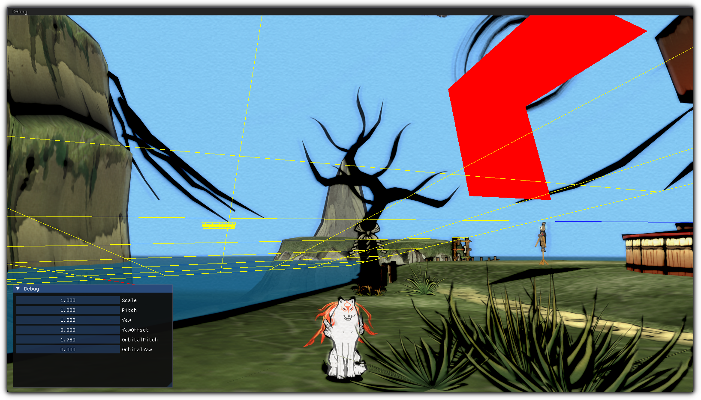

# Susano Visual Assistant
Susano is a visual in-game helper library designed to visualize object collision meshes and boundaries. This project is in it's very early days and by all means not production ready.

